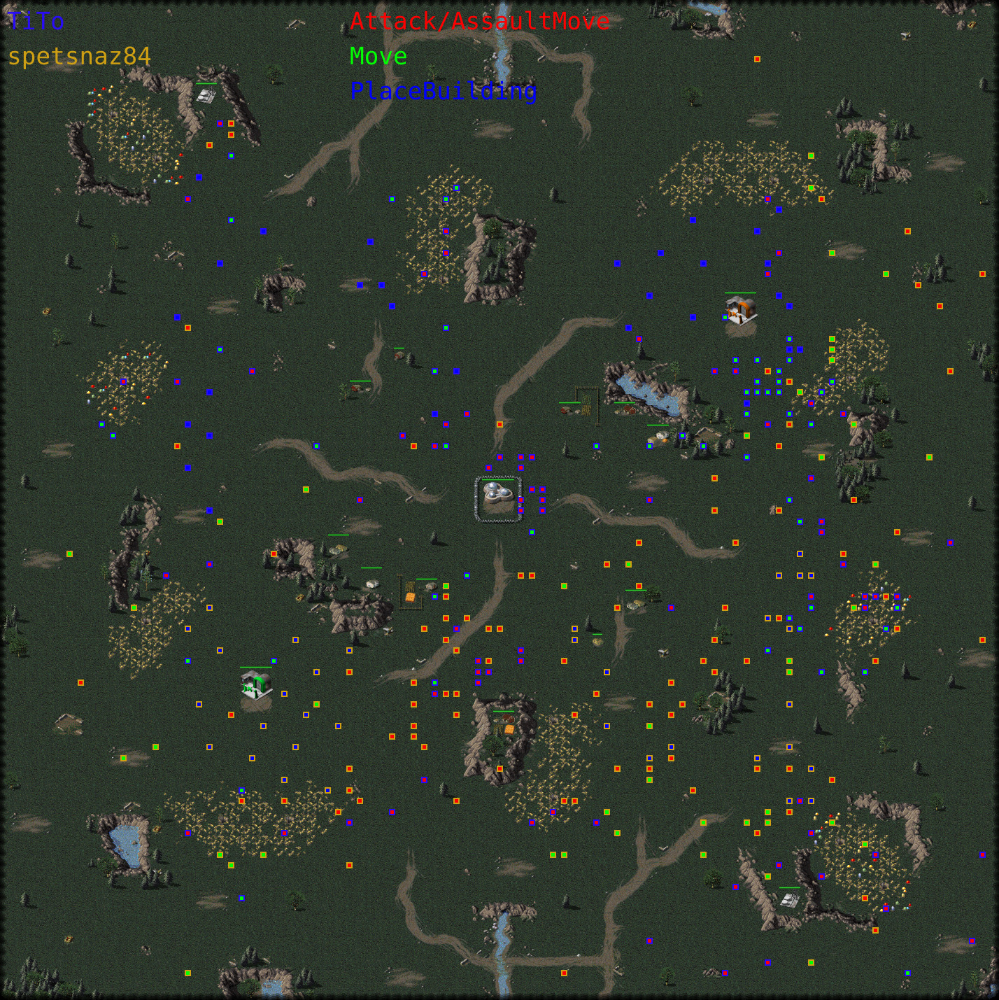

# OpenRA-heatmap

This program will take in an OpenRA replay and produce an image of the game's map with markers indicating game activity.

It the end, the goal is that this program will read in multiple game replays of the same map and produce a heatmap that shows which parts of the map are 'hot'.

# How to run
- `cargo run <your replay file>` (the first time you do run this, it will build the program - this takes a few minutes).
Note that you need the Rust build tools.
- Now you can open 'output.png' with your favorite image viewing tool.

# But it does not work
The map needs to have a corresponding screenshot present on https://resource.openra.net/maps/.
Without a screenshot, it does not work. If your favorite map does not have a screenshot yet, maybe you can upload one ?

It's very well possible there are other bugs in the software, feel free to let me know. I will have a look when time permits.

# Not all 'actions' are shown
True, I did not want to overload the output image. Moreover, some actions are hard to render as they require a lot of game state to
render correctly. E.g. the 'Attack' command, uses a target-id. But you need to know the game state to have the coordinates of the
target-id. It is not the intention to completely reimplement the game in this program :)
Therefore I only render coordinates which use world coordinates.

# Does this work with all OpenRA mods ?
I think it does but I only tried Red Alert.

# Why did you make this ?
I wanted to learn more about the Rust programming language. 
I have done some other projects in the past such as [RustySnake](https://github.com/praetp/rustysnake) with Rust
but Rust has evolved a lot in the meanwhile and I want to take it up again. Moreover OpenRA is such a great game that I felt writing such a tool
was a way to contribute back.

# Any other OpenRA tools worth mentioning ?
Definitely.
- https://github.com/tttppp/openraAnalysis (have a look at the excellent analysis of replay games of past RAGL's)
- https://github.com/AMHOL/openra-ruby
- https://dragunoff.github.io/OpenRA-replay-analytics/ 
- https://github.com/netnazgul/openra-replay-parser (not sure if it is kept up-to-date)

# Example output

